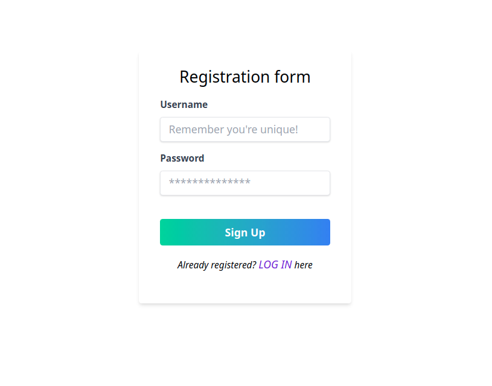
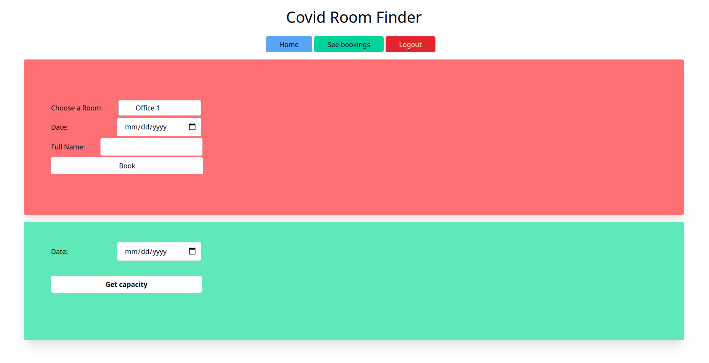
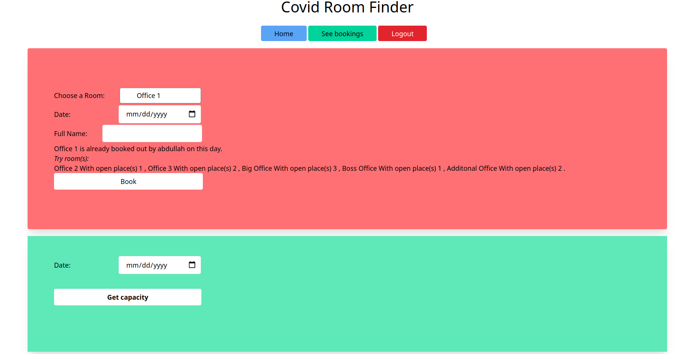

# Covid Room Finder


<table>
  <tr>
    <td></td>
</tr>

  <tr>
    <td> </td>
  </tr>
  <tr>
    <td> </td>
  </tr>
 </table>
 <hr/>

## About the project
During the global pandemic, social distancing become a  necessary as a prevention to the virus. Distancing is not only important in outside world, but also inside a working place. 
<br/> 
This project helps to find if an office room has empty space or already reached it's limit by others. If room is empty, an employe can book that room for a specific day. If the room is full already, Then employee will see other rooms having empty places. Employee can get the total percentage of empty space on a specific day.


## Stacks

  - Python
  - Django
  - Tailwind CSS
  <!-- - AJAX
  - Deployment (Heroku) -->


## Features
 - User Registration,Login  with Validation
 - Employee can book a room for a specific date if it is empty
 - If the room is full, system will show the following info -
```
1. Name of the employees who have booked it.
2. Name of the rooms those have still empty spaces 
3. Number of empty spaces of each rooms.
```

 - Percentage of emtpy spaces of all rooms on a specific date
 - Employee can cancel a booking antime from his dashboard.
 - Live Demo on Heroku
 


### Live Demo
Click the link to see live demo

[](https://covidroom.herokuapp.com/)

